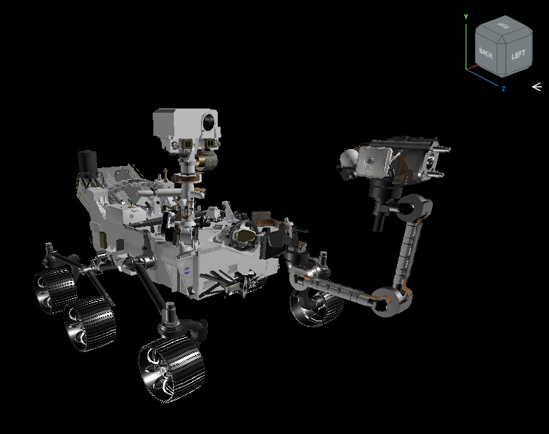

# ViewCubeHelper

This View Cube helper provides an easy navigation tool to your three.js view:



https://github.com/user-attachments/assets/168f1589-ea7d-448f-9edf-c655c719e8ae

## Setup
```
$ npm install
```

## Test
```
$ npm start 
```

# Credit
Original design led by Christiahn Roman.
Original implementation led by Benjamin Nuernberger.
Made originally for ProtoSpace at JPL.
M2020 Perseverance Rover model from https://science.nasa.gov/resource/mars-perseverance-rover-3d-model/.

# License
Copyright 2025, by the California Institute of Technology. ALL RIGHTS RESERVED. United States Government Sponsorship acknowledged.
